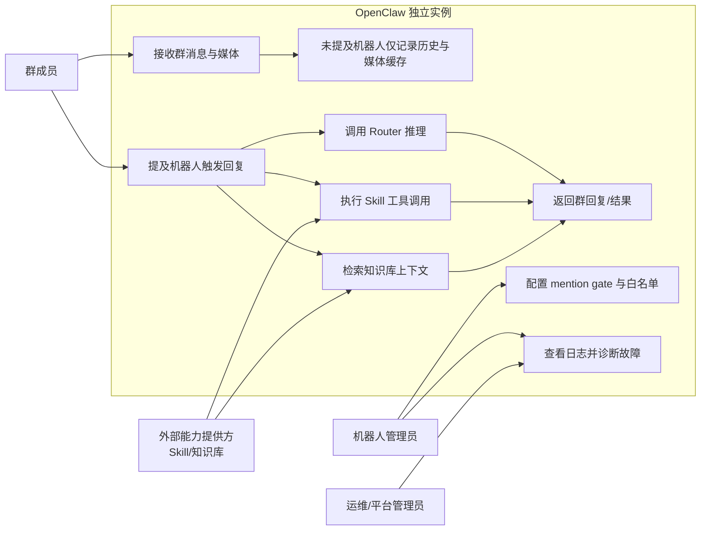
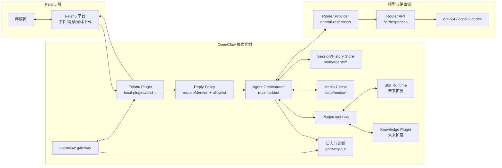
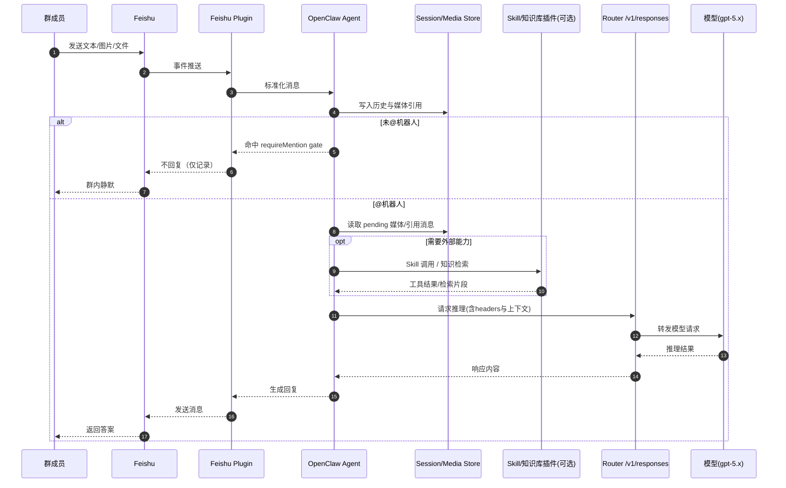
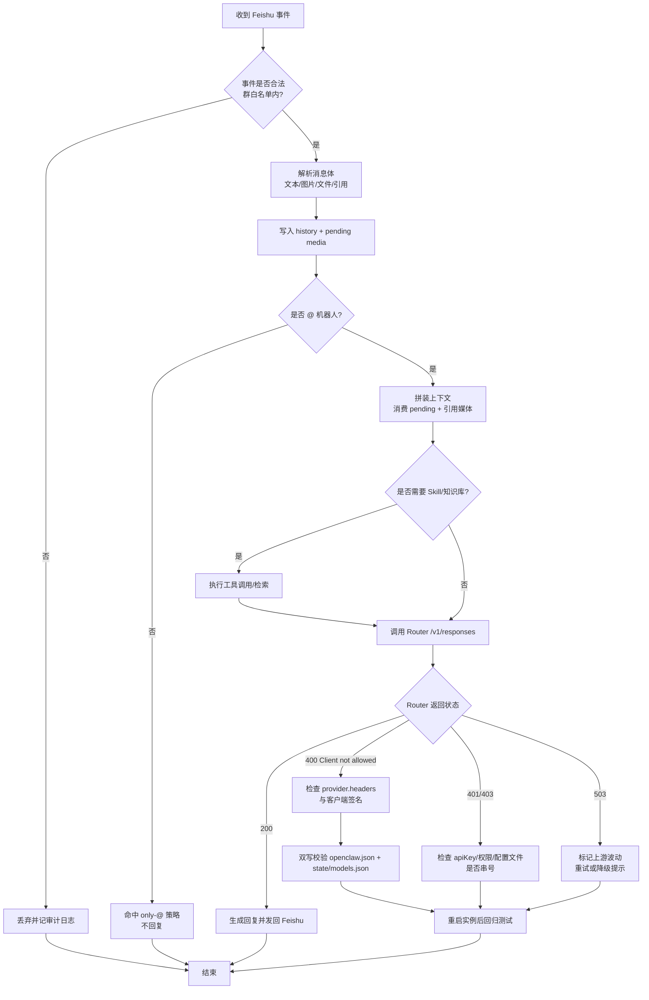

# OpenClaw × Feishu × Router 交互图集（含 Skill/知识库扩展）

> 依据文档：
> - `OpenClaw_007_独立飞书读全群仅AT回复复现手册_20260403.md`
> - `OpenClaw_008_独立飞书机器人Router客户端拦截攻坚复盘_20260407.md`
>
> 目标：统一说明 OpenClaw 与 Feishu、Router 及未来 Skill/知识库插件的交互边界与执行链路。

---

## 1) 用例图（Mermaid 兼容表示）

---

## 2) 架构图（当前 + 未来扩展）

---

## 3) 序列图（核心消息链路）

---

## 4) 流程图（消息处理与故障分流）

---

## 5) 交互原则（从两份复盘抽象）

1. OpenClaw 是编排中枢：负责策略决策、上下文管理、工具编排、模型调用。
2. Feishu 插件是 I/O 入口：负责收发消息与媒体，不负责最终推理决策。
3. Router 是模型路由与策略边界：`/models` 可用不代表 `/responses` 可用，必须以推理接口验证。
4. Skill/知识库插件应挂在 Tool Bus：避免和 Feishu/Router 强耦合，便于后续增删扩展。
5. “读全群仅@回复”本质是策略分流：未@走“记录路径”，@走“推理路径”。
