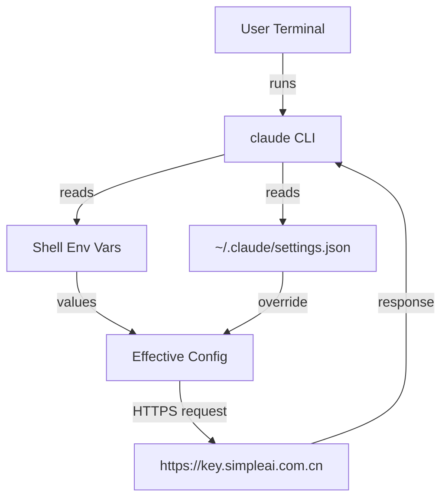

# Claude Code 国内镜像配置全流程（可无脑复现）

你看到的这份记录，来自一次真实排障：
- 现象：`claude` 返回 `Client not allowed (detected: claude-code-cli-sdk)`。
- 结论：并不是环境变量写错，而是 `~/.claude/settings.json` 里已有旧配置，Claude Code 优先使用它，导致请求被上游拒绝。
- 修复：把 `settings.json` 的 `ANTHROPIC_BASE_URL` 和 `ANTHROPIC_AUTH_TOKEN` 改成正确的镜像地址与 Key。

读完这篇，你能从 0 到通，并且知道“为什么”。

**Context**
- 环境：WSL / Ubuntu，当前用户 `snw`
- 工作目录：`/home/snw/Claude/test`
- Claude Code 可执行文件：`/home/snw/.nvm/versions/node/v20.19.5/bin/claude`
- 镜像地址：`https://key.simpleai.com.cn`

**Absolute Paths**
- `~/.bashrc` 实际路径：`/home/snw/.bashrc`
- Claude Code 配置：`/home/snw/.claude/settings.json`
- Claude Code 数据目录：`/home/snw/.claude`
- 目标笔记目录：`/mnt/f/BaiduDesknetDdownload/Obsidian/SAD/claude`

**Directory Structure**
```
/home/snw/.claude
├── config.json
├── debug/
├── history.jsonl
├── plugins/
├── projects/
├── settings.json
├── shell-snapshots/
├── stats-cache.json
└── todos/
```

**Checklist**
1. 确认 shell 类型与 Claude Code 是否已安装
2. 写入环境变量（镜像地址 + API Key）
3. 处理 Claude Code 自己的配置覆盖
4. 验证连通性

**Step 1: 确认 shell 与 CLI 是否存在**
命令：
```bash
# 1) 判断你用的是 bash 还是 zsh

echo $SHELL

# 2) 检查 Claude Code 是否已安装，顺便查看版本

which claude && claude --version
```
参数说明：
- `echo $SHELL`：输出当前 shell 路径。
- `which claude`：定位 `claude` 可执行文件的绝对路径。
- `claude --version`：确认已安装且版本可用。

为什么要做：
- Claude Code 的配置文件路径与 shell 启动逻辑有关。
- CLI 未安装时，后续配置全部白做。

**Step 2: 写入环境变量（按你的 shell 选择）**
如果 `echo $SHELL` 输出 `/bin/bash`：
```bash
# 追加镜像地址与 API Key 到 bash 配置

echo 'export ANTHROPIC_BASE_URL="https://key.simpleai.com.cn"' >> ~/.bashrc
echo 'export ANTHROPIC_AUTH_TOKEN="<你的API Key>"' >> ~/.bashrc

# 立即生效（交互式终端中）

source ~/.bashrc
```
如果是 `/bin/zsh`，把 `~/.bashrc` 改成 `~/.zshrc` 即可。

参数说明：
- `ANTHROPIC_BASE_URL`：Claude Code 的请求地址，指向国内镜像。
- `ANTHROPIC_AUTH_TOKEN`：API Key，必须替换成你自己的。
- `source`：让当前终端立刻加载最新配置。

为什么要做：
- Claude Code 会从环境变量读取服务地址和认证信息。
- 这样做能让每个新终端都自动继承配置。

重要细节（很多人踩坑）：
- 你的 `~/.bashrc` 顶部通常有“非交互直接 return”的逻辑：
```bash
case $- in
    *i*) ;;
      *) return;;
esac
```
- 这意味着在非交互 shell 中，`source ~/.bashrc` 可能不会生效。
- 解决方法：新开一个终端再试，或者用 `bash -i -c 'source ~/.bashrc; claude -p "ping"'`。

**Step 3: 处理 Claude Code 自己的覆盖配置（关键步骤）**
真实排障时发现：Claude Code 会读取 `~/.claude/settings.json` 里的 `env`，它会覆盖 shell 环境变量。旧配置如果指向其它镜像，就会导致你一直报错。

查看当前配置：
```bash
cat /home/snw/.claude/settings.json
```

修复方式：
1. 直接更新 `env` 的 `ANTHROPIC_BASE_URL` 和 `ANTHROPIC_AUTH_TOKEN`
2. 或者删除整个 `env` 块，让 CLI 只读 shell 环境

参考修复后的 `settings.json` 结构：
```json
{
  "env": {
    "ANTHROPIC_AUTH_TOKEN": "<你的API Key>",
    "ANTHROPIC_BASE_URL": "https://key.simpleai.com.cn",
    "CLAUDE_CODE_DISABLE_NONESSENTIAL_TRAFFIC": "1"
  },
  "permissions": {
    "allow": [],
    "deny": []
  },
  "model": "opus"
}
```

为什么要做：
- Claude Code 优先使用 `~/.claude/settings.json` 里的 `env`。
- 如果这里是旧值，就会“看似正确却永远不生效”。

**Step 4: 验证连接是否成功**
命令：
```bash
claude -p "ping"
# 或者
claude chat "你好"
```
参数说明：
- `-p`：一次性 prompt 测试，返回短答更快。
- `claude chat`：进入对话模式验证通路。

成功标志：
- 返回 `Pong! I'm here and ready to help.`
- 或者 Claude 正常回复中文

失败时常见报错与含义：
- `Client not allowed (detected: claude-code-cli-sdk)`：上游拒绝此客户端，通常是 Base URL 或 Key 不在允许列表。

**Architecture**
Claude Code 的配置读取路径可以用下面这张图记住：


**Mermaid Render Check**
这张图已用 `mermaid-cli` 语法校验通过，并成功生成 `/tmp/claude-setup.svg`（2026-04-06）。

**Validation Command (Mermaid)**
```bash
# 需要 node 环境，使用 npx 下载并运行 mermaid-cli
# 这会把上面的 mermaid 片段渲染成 SVG 以验证语法

npx -y @mermaid-js/mermaid-cli -i /tmp/claude-setup.mmd -o /tmp/claude-setup.svg
```

**Parameter Notes (关键命令速查)**
- `rg -n "ANTHROPIC_" ~/.bashrc ~/.zshrc`：快速定位环境变量是否已写入。
- `env | rg '^ANTHROPIC_'`：检查当前 shell 是否已有环境变量。
- `claude -p "ping"`：最小请求验证连通性。

**Why This Works (核心原理)**
- Claude Code 读取配置有优先级：`~/.claude/settings.json` 高于 shell 环境。
- `.bashrc` 默认只在交互式终端生效，所以“写了但没生效”很常见。
- 一旦 `settings.json` 改成正确的 Base URL + Key，请求就会走正确的上游镜像。

**Quick Copy（最短复现路线）**
```bash
# 1) 写入 bash 配置（按需替换为 zsh）

echo 'export ANTHROPIC_BASE_URL="https://key.simpleai.com.cn"' >> ~/.bashrc
echo 'export ANTHROPIC_AUTH_TOKEN="<你的API Key>"' >> ~/.bashrc

# 2) 更新 Claude Code 的 settings.json

cat > /home/snw/.claude/settings.json <<'JSON'
{
  "env": {
    "ANTHROPIC_AUTH_TOKEN": "<你的API Key>",
    "ANTHROPIC_BASE_URL": "https://key.simpleai.com.cn",
    "CLAUDE_CODE_DISABLE_NONESSENTIAL_TRAFFIC": "1"
  },
  "permissions": {
    "allow": [],
    "deny": []
  },
  "model": "opus"
}
JSON

# 3) 新开终端或 source，然后验证

source ~/.bashrc
claude -p "ping"
```

读到这里，你已经具备“从 0 到通”的全套方法，而且知道为什么会通。
