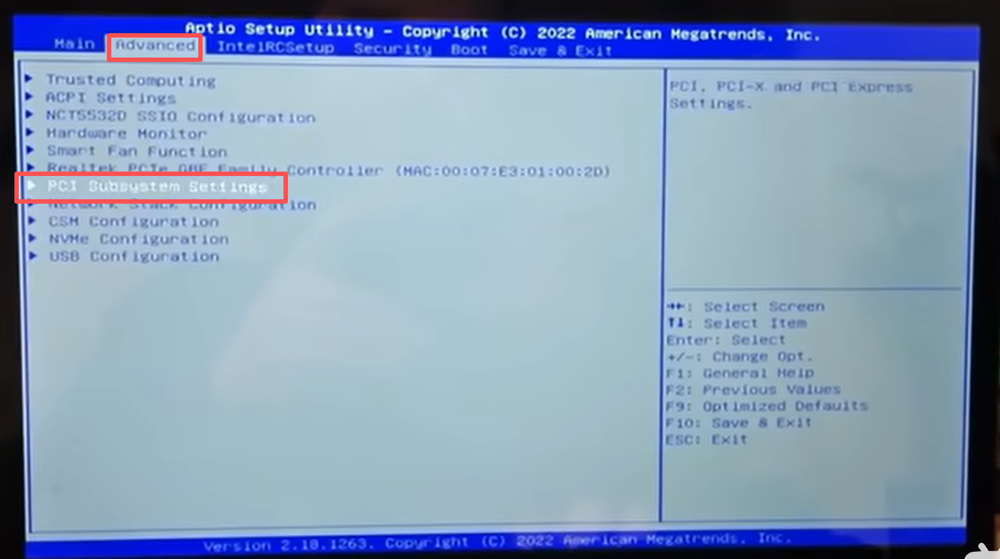

先给你结论：精粤X99-8D3/2.5G双路大板 + 1060/1070 + Tesla V100 32G 完全可行，但必须在BIOS里做4个关键设置，否则大概率黑屏、V100不认或性能跑不满。

一、主板与硬件前提（先确认）

• 主板：精粤X99-8D3/2.5G（3×PCIe 3.0 x16，双路E5 v3）

• CPU：必须是E5 v3系列（v4不支持此板），要有足够PCIe通道（双路更稳）

• 插槽建议：

◦ 1060/1070（输出）：PCIe_1（靠近CPU的第一条x16）

◦ Tesla V100（计算）：PCIe_2 或 PCIe_3

• 电源：额定850W+，V100 32G约300W，1070约150W，双路CPU+内存也要预留

• 散热：V100必须用涡轮/定制水冷，不能用普通风冷

二、BIOS进入与基础（精粤X99通用）

• 开机按 Del 进BIOS（AMI Aptio）

• 主菜单：Main / Advanced / IntelRCSetup / Boot / Save & Exit

• 保存：F4；恢复默认：F9；快速启动：F7

三、必改BIOS设置（按顺序）

1. 开启 Above 4G Decoding（最关键）

• 路径：Advanced → PCI Subsystem Settings

• 找到：Above 4G Decoding → Enabled

• 作用：让系统识别V100的32G显存（4GB以上PCIe地址空间）

2. 主显示输出（Primary Display）

• 路径：Advanced → PCI Subsystem Settings 或 Chipset → Graphics Configuration

• 设置：Primary Display → PCIe（不要选IGD/CPU集显）

• 作用：强制从1060/1070输出画面，避免V100抢输出导致黑屏

3. PCIe 速度与节能（防降速/不认）

• 路径：IntelRCSetup → IIO Configuration

• 关键项：

◦ PCIe Speed → Gen3（不要Auto，避免跑Gen2）

◦ PCIe ASPM → Disabled（关闭节能，提升稳定性）

◦ PCIe Hot Plug → Disabled（多卡场景建议关）

4. 关闭CSM（UEFI优先，Win10/11必须）

• 路径：Advanced → CSM Configuration

• 设置：

◦ CSM Support → Disabled

◦ 若无法直接关：先把 Video/Storage/Network 都设为 UEFI，保存重启再关CSM

5. 可选：CPU节能（提升计算稳定性）

• 路径：IntelRCSetup → Advanced Power Management

• 建议：

◦ CPU C-State Control → Disabled（或Package C-State Limit → C0/C1）

◦ CPU C3/C6 Report → Disabled

四、安装与驱动（Windows）

1. 先只装1060/1070，进系统，装NVIDIA Game Ready驱动

2. 关机，插V100，开机进BIOS，按上面设置保存

3. 进系统，设备管理器会看到两个NVIDIA显卡

4. 装NVIDIA Data Center Driver（DC驱动）（不要用Game Ready）

◦ 版本：535+ / 545+（支持V100+消费卡共存）

5. 验证：

◦ 任务管理器 → 性能 → GPU：看到两个GPU

◦ nvidia-smi：V100显示为Tesla V100-PCIE-32GB

五、常见问题与排查

• 黑屏/无显示：

◦ 检查Primary Display设为PCIe、CSM已关、Above 4G已开

◦ 显示器接1060/1070，不要接V100（V100无视频输出）

• V100不识别：

◦ Above 4G Decoding必须Enabled

◦ 换PCIe插槽、检查供电（V100要双8pin/双6+8pin）

◦ 更新主板BIOS到最新（精粤官网002版）

• 性能跑不满：

◦ PCIe Speed设为Gen3

◦ 关闭CPU C-State、PCIe ASPM

◦ 双路CPU要插满，否则PCIe通道不足

六、最终BIOS设置清单（可直接照着设）

1. Above 4G Decoding → Enabled

2. Primary Display → PCIe

3. PCIe Speed → Gen3

4. PCIe ASPM → Disabled

5. CSM Support → Disabled

6. CPU C-State → Disabled（可选）
