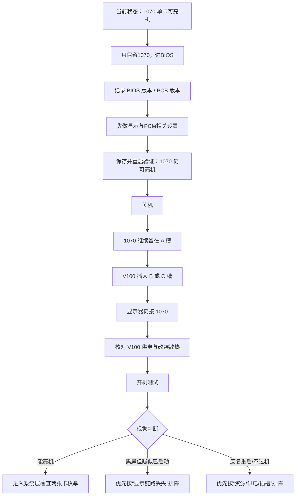
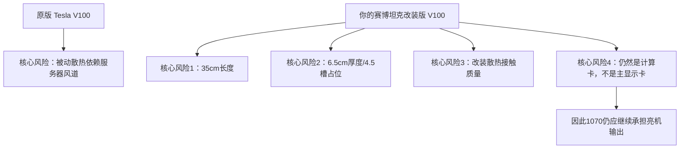
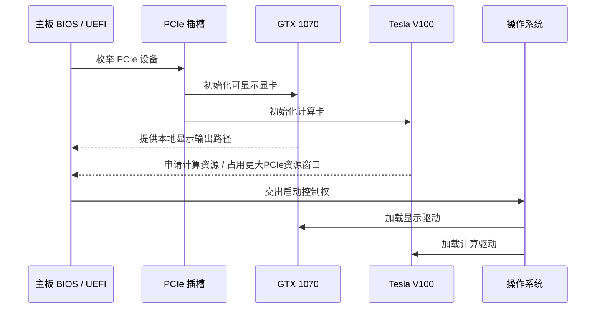
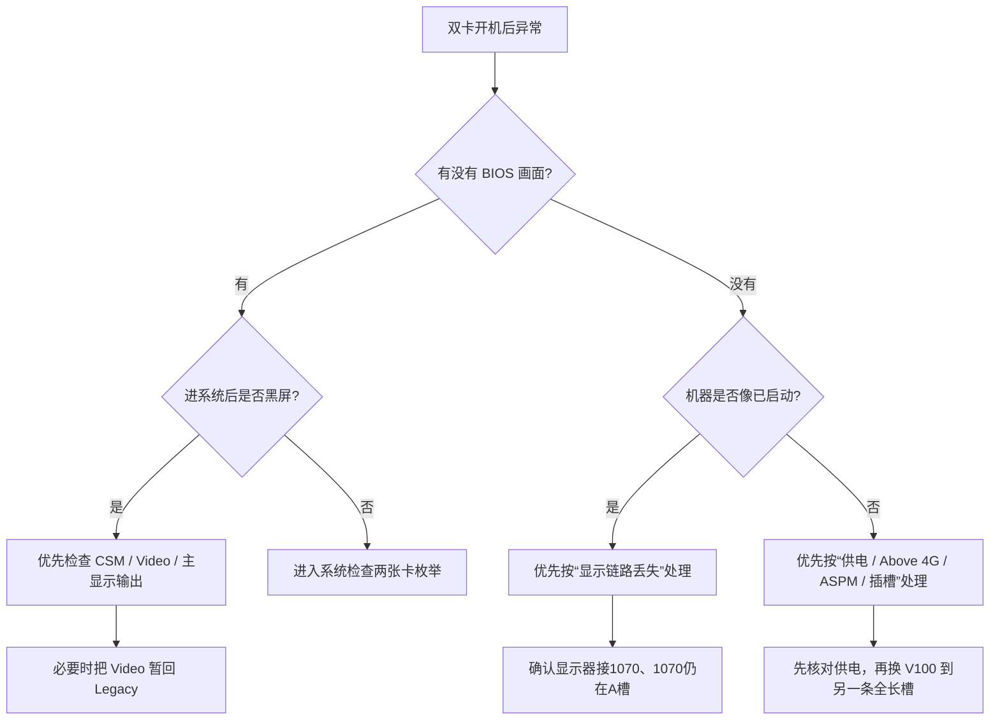

# 精粤 X99-8D3/2.5G（双路 E5-2696 v3、DDR3 128GB）

# Tesla V100 32GB + GTX 1070 混插 BIOS / 插槽 / 亮机 / 排障实战手册

> 这不是一篇“差不多就行”的说明，而是一份按**你现在这台机器的真实目标**写的 bring-up 手册：
> 
> - 主板：精粤 **X99-8D3/2.5G**
>     
> - CPU：**E5-2696 v3 ×2**
>     
> - 内存：**DDR3 ECC 128GB**
>     
> - 现状：**单插 GTX 1070 可以正常亮机**
>     
> - 目标：**同时插 Tesla V100 32GB 与 GTX 1070，并且稳定开机、能亮机、能继续往系统层走**
>     
> 
> 这套机器最容易踩的坑，不是“V100 性能不够”，而是：**主显示卡判断、PCIe 资源分配、CSM/UEFI 初始化方式、供电接法、改装散热的风路与空间占用、以及双路 X99 对插槽的挑剔**。

---

## 0. 先给结论：最稳方案不是“V100 顶掉 1070”，而是反过来

**最稳的第一目标方案：**

- **GTX 1070 继续留在现在那个能正常亮机的主槽位**，专门负责本地显示
    
- **Tesla V100 32GB 插到另一条全长 PCIe 槽**，专门负责计算
    
- **显示器永远接在 1070 上，不接 V100**
    

这一步看似“保守”，实际上是最专业的 bring-up 思路。原因很简单：

1. **Tesla V100 PCIe 是计算卡，不是常规显示输出卡**。它本身不适合承担“我插显示器就要看到 BIOS 画面”的职责。
    
2. **你现在已经知道 1070 单卡能亮机**。工程上最稳的办法，是先保留一条已经被验证过的亮机链路，再把 V100 当作“第二张被枚举的高性能设备”加进去。
    
3. 这块板是**双路 X99 + 三条物理 x16**，而不是一块简单的消费级单路板。老平台、多根 Root Port、多卡、再叠加大显存卡，最容易出的问题就是：**系统不一定真的没启动，但本地黑屏，让人误判为“开不起来”**。
    

一句话概括：

> **先保住“亮机”，再扩展“算力”。**
> 
> 对你这台机器，1070 是“灯塔”，V100 是“引擎”。别一上来就把灯塔拔了。

---

## 1. 本文的信息可信度分层：哪些是“官方能直接确认”的，哪些是“实机要核对”的

为了尽量严谨，下面把信息分成三层：

### A. 你上传的 BIOS 设置说明里，已经直接确认的内容

这些可以视为**这块板 BIOS 里确实存在的菜单路径或快捷键**：

- 进 BIOS：`Delete`（不是小键盘小数点那个 Del）
    
- 启动菜单：`F11`
    
- 保存退出：`F10`
    
- 风扇调试：`Advanced -> Hardware Monitor -> Smart Fan Configuration -> CPU FAN Mode`
    
- 兼容模式视频路径：`Advanced -> CSM Configuration -> Video`
    
- 内存频率：`IntelRCSetup -> Memory Configuration -> Memory Frequency`
    
- 硬盘启动顺序：`Boot -> Boot Option #1`
    
- VT-D：`IntelRCSetup -> IIO Configuration -> Intel VT for Directed I/O (VT-D)`
    
- 来电自启：`IntelRCSetup -> PCH Configuration -> PCH Devices -> PCH state after`
    
- 无盘网卡启动：`Advanced -> CSM Configuration -> Network [Legacy] -> Boot -> Network Device BBS Priorities`
    

### B. 精粤官方产品页已经确认的内容

这些可视为**硬件规格层面的官方事实**：

- 这块板是 **X99-8D3/2.5G 双路大板**
    
- **DDR3 ×8 插槽**
    
- **3 × PCIe x16（物理全长） + 2 × PCIe x1**
    
- **24Pin ×1 + 8Pin ×2** 主板供电
    
- 支持 **E5-2696 v3**，也列出过 **2696 v4**，但又注明“鸡血 BIOS 支持 E5 v3；E5 v4 不支持”
    
- 官方给过多版 BIOS，其中有 2024-06-04、2024-06-05 的 8D3/2.5G BIOS 包
    

### C. 同系精粤双路 X99 BIOS / 社区实机里常见、但你现场仍要核对的内容

这些大概率存在，但建议你进 BIOS 时**逐项核对是否可见**：

- `Above 4G Decoding`
    
- `CSM Support`
    
- `PCIe ASPM`
    
- `Re-Size BAR`
    
- `MMIOHBase`
    
- `MMIO High Size`
    
- `Legacy VGA Socket`
    

这类设置对“V100 + 1070 混插能不能过机”非常关键，但因为不同 BIOS 版本、不同 PCB 版号的中文板常有小差异，所以正确做法不是“想当然”，而是：

> **先按本文路径去找；如果名字接近、层级略有差异，以实际 BIOS 为准。**

---

## 1A. 先修正最关键的前提：你这张不是“原版被动散热 V100”，而是“改装风冷赛博坦克版”

你补充的购买信息表明，这张卡不是标准裸卡/原厂被动散热状态，而是已经做过**大体积三风扇风冷改装**，卖点包括：

- `Tesla V100-32G 赛博坦克`
- `3 × 100mm 风扇`
- `8 × 6mm 热管 + 纯铜底座`
- `4.5 槽厚散热模组`
- `35cm 长`
- `6.5cm 厚`
- 卖家宣称压力测试温度仅 40 多度、静音、无视频接口

这会直接改写原手册里的两类判断：

1. **散热逻辑变了**

你的卡已经不再是“必须依赖服务器风道才能活”的原始状态，而是“带超大主动风冷模组的改装计算卡”。

2. **空间/插槽逻辑更严峻了**

原版被动卡最大的问题是风道；你这张改装版现在更大的现实问题反而变成：**厚度、长度、挡槽、压线材，以及和 1070 的物理共存**。

换句话说，问题重心发生了迁移：

- **原版 V100**：更怕没有服务器风道
- **你这张改装 V100**：更怕塞不下、挡住副槽、压到线材、或把 1070 的生存空间吃掉

### 仍然成立的核心结论

- **1070 继续担任亮机卡，V100 继续做计算卡**
- **先保住 A 槽已验证亮机链路，再谈双卡扩展**
- **黑屏不等于没开机，本地显示链路仍是最常见误判**

### 必须修正的部分

- 不能再把它简单当成“原版被动散热卡”处理
- 选择 A + C 的理由要从“给风道”扩展到“先通过机械共存”
- 散热排障的重点从“补服务器风道”转到“验证改装散热器本身是否靠谱”

---

## 2. 先把原理想透：为什么插上 V100 后，机器会“像死了一样”

很多人以为“插上 V100 黑屏”就等于“主板不兼容”或者“V100 坏了”。

其实在你这类平台上，更常见的真相是下面四类之一：

### 2.1 不是没开机，而是**没有本地画面**

Tesla V100 是计算卡。它的角色更像“超级算力协处理器”，而不是“接显示器给你看 BIOS 的那张民用显卡”。

所以当你把 V100 当主卡插、或者 BIOS 把它误当成先初始化对象时，可能出现这样的场景：

- 机器其实已经过了自检
    
- 系统其实已经启动了
    
- 网卡灯亮、甚至远程都能通
    
- **但本地显示器黑屏**
    

这时人最容易做出的错误判断就是：

> “完了，主板开不起来。”

实际上很可能只是**显示路径丢了**。

### 2.2 PCIe 资源不够，或者初始化顺序不对

对原版 V100 来说，挑战之一不是“插槽物理装不装得下”，而是 PCIe 资源；但你这张改装版在进入这些电气问题之前，先要过物理关。在电气层面，它仍然会遇到：

- 它需要更大的 MMIO 地址空间
    
- 它的 BAR 资源分配比一般小显存卡更挑平台
    
- 双路 X99 本身还要处理多颗 CPU、多组 Root Complex、多条 PCIe 根端口
    

于是 BIOS 在做 PCIe 枚举时，如果：

- `Above 4G Decoding` 没开
    
- CSM / UEFI 初始化方式冲突
    
- 某条槽在那套资源分配下不顺
    

就会出现：

- 黑屏
    
- 卡自检
    
- 重启循环
    
- 插一张能亮，插两张不亮
    

### 2.3 供电“看着插上了”，但其实接法不对

这类问题极其常见。

- **GTX 1070**：典型民用卡思路，常规 PCIe 8-pin 供电
    
- **Tesla V100 PCIe**：它的辅助供电设计思路更偏服务器/工作站，接法和普通游戏卡不是一个思维模型
    

所以“线能插进去”不等于“接法正确”。

### 2.4（修订版）这张 V100 已经不是“原版被动卡”，但改装风冷并不等于万事大吉

你手上的不是标准原版被动散热 V100，而是卖家改成了**赛博坦克三风扇超厚风冷版**。这意味着：

- 你不必再完全按“服务器风道卡”思路理解它
    
- 但你要开始把它当成一张**超重度改装卡**来审视
    

它的优势是：

- 理论上本地主动风冷能力更强
    
- 不再绝对依赖服务器直通风道
    
- 如果改装质量过关，温度与噪音可能确实明显优于原版裸被动状态
    

它的新风险则是：

- **35cm 长度**可能干涉机箱前部空间
    
- **6.5cm 厚度 / 4.5 槽体积**可能直接吃掉相邻 PCIe 槽位
    
- 自定义散热器可能带来**装配误差、导热垫厚度问题、压紧力不均、供电/显存热点控制失衡**
    
- 卖家宣称“40 多度、极静音”只能作为参考，不能替代你自己的实测
    

所以现在正确的认知不再是：

> “这卡没风扇，会不会热死？”

而是：

> “这套大改风冷到底改得好不好，以及它会不会把整个平台的机械布局彻底改坏。”
    

---

## 3. 你的机器在这次任务里的正确分工

### 推荐分工

- **GTX 1070：亮机卡 / 本地显示卡 / BIOS 观察窗口**
    
- **Tesla V100：计算卡 / CUDA 卡 / 第二张被系统枚举的高性能设备**
    

### 不推荐的第一轮方案

- 不推荐一上来就把 **V100 插主槽位**，再让 **1070 去副槽位** 试图亮机
    

不是说这种做法绝对不可能成功，而是它会把本来就复杂的问题一下子叠满：

- 你失去已经验证过的显示链路
    
- 你把主显示卡判断交给 BIOS 去“猜你想干嘛”
    
- 你会很难区分：到底是**主板没过机**，还是**系统起来了但画面没了**
    

工程上这是不划算的。

---

## 4. 先看懂这块板上的“逻辑拓扑”

精粤官方确认了：这块板有 **3 条物理 x16 全长槽**。但官方页面并没有把三条槽各自到底是 **x16 / x8 / 属于哪颗 CPU 的哪组 PCIe Root Port** 完整公开出来。

这意味着：

- **你不能只靠“看起来像主槽”就绝对下结论**
    
- 真正严谨的做法，是把你现在能亮机的那条槽，定义成 **A 槽（已验证亮机槽）**
    
- 其余两条全长槽定义成 **B 槽、C 槽**，通过实测去找 V100 最合适的位置
    

### 本文采用的槽位命名法

- **A 槽**：你现在插 1070、能正常亮机的那条槽
    
- **B 槽**：中间那条全长槽
    
- **C 槽**：剩下那条全长槽（通常更外侧）
    

这样做有一个巨大好处：

> 无论网上别人怎么称呼“主槽”“副槽”，你都不会被文字绕晕。
> 
> 你只需要围绕你自己机器上**已经被验证成功的 A 槽**来行动。

---

## 5. 整个 bring-up 策略，一张图看懂

这张图故意画得很朴素，因为朴素往往最可靠。

---

## 6. 正式操作：第一阶段——只插 1070，把 BIOS 地基打好

这一阶段的目标只有一个：

> **在不动 V100 的前提下，把 BIOS 调成更适合双卡混插的状态，同时确保 1070 还能正常亮机。**

### 6.1 进入 BIOS

- 开机按：`Delete`
    
- 保存退出：`F10`
    
- 启动菜单：`F11`
    

### 6.2 先记下两件事

1. **PCB 丝印版本**（例如是否写着 V2.xx）
    
2. **当前 BIOS 版本**
    

理由：后面如果你真的需要刷 BIOS，这两项是第一判断依据。

### 6.3 先恢复一个干净起点

如果你怀疑卖家、前任使用者、或者自己之前已经改过很多选项，建议先：

- Load Optimized Defaults（如果有）
    
- 保存重启后，再重新进入 BIOS
    

这样做的意义不是“玄学重置”，而是把未知变量清掉。

### 6.4 先处理显示初始化逻辑：找到 CSM / Video 那组菜单

根据你上传的官方说明，路径已经确认存在：

- `Advanced -> CSM Configuration -> Video`
    

官方说明里给的是：

- `Video [Legacy]`
    

这说明两件事：

1. **这块板的 BIOS 确实有 CSM/视频兼容模式这一层开关**
    
2. 你后面要做的“Legacy / UEFI”切换，是有现实入口的，不是空谈
    

### 6.5 推荐的第一轮设置：把视频初始化朝 UEFI 方向推

#### 推荐做法

先进入：

- `Advanced -> CSM Configuration`
    

然后优先尝试：

- `Video = UEFI`（如果可选）
    

如果这个菜单下还有以下项目，也建议朝 UEFI-only 方向收：

- Storage = UEFI
    
- Network = UEFI
    
- Other PCI devices = UEFI
    

然后：

- 按 `F10` 保存
    
- 重启
    
- **再次确认：仅插 1070 时，机器依然能进 BIOS、依然能正常出画面**
    

#### 为什么这样做

因为 V100 这类新式大资源卡，通常更适合在 **UEFI + Above 4G** 的环境下被稳定枚举；而 `Legacy` 兼容链路本身就是为了照顾更老旧的启动/显卡生态。

#### 但一定要记住退路

你上传的官方说明已经告诉我们：

- `Advanced -> CSM Configuration -> Video [Legacy]`
    

这条路径是**你的回退按钮**。

也就是说，如果你改成 UEFI 后，1070 反而不稳定或你连 BIOS 都看不到了，你可以：

- 回到这一路径
    
- 暂时把 `Video` 改回 `Legacy`
    

这就是为什么掌握“路径”比记住“结论”更重要。

### 6.6 处理 PCIe 资源分配：优先开启 Above 4G Decoding

如果你在 BIOS 中能看到：

- `Above 4G Decoding`
    

请优先改成：

- `Enabled`
    

#### 为什么这一步几乎是必做项

因为你不是在插第二张小卡，而是在给老平台加一张 **V100 32GB** 级别的设备。它对 PCIe 资源窗口更敏感。

如果这项不打开，平台更容易在多卡情况下出现：

- 资源分配不足
    
- 某张卡枚举失败
    
- 开机阶段黑屏或卡住
    

### 6.7 如果 BIOS 里看得到 `CSM Support` 总开关

建议流程是：

1. **先把各子项改成 UEFI**
    
2. 保存重启确认 1070 还能亮
    
3. **再考虑把 `CSM Support` 总开关关掉**
    

为什么不建议一上来就暴力关？

因为你现在的第一任务不是“追求最纯粹的 UEFI 美学”，而是：

> **既要让 BIOS 更适合 V100，又不能把现有唯一稳定的亮机链路一起打断。**

### 6.8 如果看得到 `PCIe ASPM`

建议第一轮就改成：

- `Disabled`
    

#### 原理

ASPM 是电源管理特性，理论上很好；但在一些老平台 + 多卡 + 特殊设备组合里，它恰恰会让兼容性更挑剔。

排障时，正确姿势通常是：

> **先求稳，再求省电。**

### 6.9 `Re-Size BAR` 怎么办？

如果 BIOS 里看得到 `Re-Size BAR`：

- **先记住位置，不作为第一优先级强制开启项**
    

理由很简单：

- 这项有时能帮到某些新显卡
    
- 但你现在真正最关键的，仍然是 **Above 4G + CSM/UEFI + 插槽选择 + 供电 + 风道/改装散热**
    

排障时不要一上来把所有高级开关都乱开，否则你会失去判断能力。

### 6.10 如果 BIOS 里看得到 `MMIOHBase / MMIO High Size`

建议：

- **先记住位置，第一轮不乱改**
    

这是“第二层资源调参工具”。只有当前面这些都做了，仍然不行时，再考虑动它。

### 6.11 如果 BIOS 里看得到 `Legacy VGA Socket`

也建议：

- **先记住位置，不作为第一轮必改项**
    

它更像一个高级选项，主要用于多 Root Complex / 双路平台下，决定传统 VGA 初始化优先落在哪个 socket/根端口一侧。

只要你坚持本手册的稳妥策略——**1070 留在已验证亮机槽**——这个选项很多时候可以先不碰。

---

## 7. 第二阶段——针对你这台“双 2696 v3 + DDR3 128GB”的专项优化

这一步很重要。你的平台不是“随便一块 X99 + 随便两条内存”，而是：

- **双路 E5-2696 v3**
    
- **8 条 DDR3 插满到 128GB（大概率 8×16GB）**
    

这意味着系统在 bring-up 时，本来就比轻载平台更复杂。

### 7.1 内存频率不要在 GPU 排障时上来就冲高

你上传的官方 BIOS 说明已经确认路径：

- `IntelRCSetup -> Memory Configuration -> Memory Frequency`
    

官方产品页列出的内存频率档位是：

- 1333 / 1600 / 1866 MHz
    

#### 我的建议

在你当前“先把双卡点亮”的阶段：

- **优先使用 `Auto` 或 1600 MHz**
    
- 不建议一开始就强行追 1866
    

#### 为什么

因为你现在的任务是定位 **“V100 一插系统就异常”** 的根因。

如果你同时还让平台处于：

- 双路 CPU
    
- 8 条内存满插
    
- 高频内存
    
- 双显卡
    

那么你引入的变量太多了。

工程排障最怕的不是问题难，而是变量太多。

#### 最务实的策略

- **第一阶段：内存先稳住（Auto / 1600）**
    
- **双卡成功后：再尝试更高频率**
    

### 7.2 VT-D 建议直接打开

根据你上传的官方 BIOS 说明，路径已确认：

- `IntelRCSetup -> IIO Configuration -> Intel VT for Directed I/O (VT-D)`
    

建议设置为：

- `Enabled`
    

#### 为什么

哪怕你现在暂时不做虚拟化直通，双路 X99 平台把 VT-D 打开一般也更符合后续扩展思路：

- 以后做虚拟机直通更方便
    
- 某些多设备资源映射场景更规范
    

### 7.3 风扇与风道，不只是“散热”，更是 bring-up 成败的一部分

你上传的官方 BIOS 说明确认了风扇调试路径：

- `Advanced -> Hardware Monitor -> Smart Fan Configuration -> CPU FAN Mode`
    

#### 对你这台机器的建议

在第一次带 V100 测试时，建议把风扇策略往更积极的方向调，至少先保证：

- CPU 区域风量足
    
- 主板供电区有风
    
- **V100 所在位置有明确、持续、定向的风流**
    

标准 V100 常见是被动散热，但你这张已是改装三风扇；风路与双卡间距仍会显著影响稳定性，也很容易被误判成 BIOS 或兼容性问题。

---

## 8. 第三阶段——正式上两张卡，正确插法是什么

## 8A. 改装赛博坦克版 V100 的三大新增风险

### 8A.1 机械空间风险

这张卡不是普通双槽卡，也不是常见三槽游戏卡，而是：

- **35cm 长**
    
- **6.5cm 厚**
    
- **约 4.5 槽体积**
    

这意味着你在这块三全长槽主板上做双卡混插时，首先不是问“BIOS 支不支持”，而是问：

> **它装进去以后，另一张卡还有没有活路。**

### 8A.2 改装可靠性风险

原版 V100 的问题，是散热形式偏服务器化；改装版 V100 的问题，则变成：

> **这套民间改装是否长期可靠。**

你要特别警惕：

- 导热垫偷工减料
    
- 只压核心，不顾显存/供电
    
- 风扇参数很漂亮，但真实静压不够
    
- 散热器太重导致 PCB 长期受力
    

### 8A.3 多卡平台生态风险

即使 V100 本体被改成了大三风扇，底层它仍然是 Tesla V100。也就是说：

- 它的“身份”仍然是计算卡
    
- 你的 1070 仍然最适合做本地显示卡
    
- BIOS 里关于 Above 4G / CSM / 插槽枚举的逻辑并不会因为外壳变酷就消失
    

这点很重要，因为卖家页面容易让人把注意力都放在“40 多度、静音、赛博坦克外观”上。

但对你真正影响最大的，仍然是：

- 它是不是能与 1070 在这块板上**共存**
    
- 它会不会把原本稳定的亮机链路搅乱
    

### 8A.4 问题重心变化示意

这张图的意义在于一眼看明白：

> **你现在的问题，不是简单从“被动 V100”变成“主动 V100”这么轻松。**
> 
> 而是从“风道兼容性问题”升级成了“机械空间 + 改装质量 + 多卡共存 + 仍然不是显示卡”的复合问题。

### 8.1（修订版）第一轮插法仍优先考虑 A + C，但必须先通过“机械兼容审查”

推荐顺序仍然是：

- **A 槽：GTX 1070**
    
- **C 槽：改装风冷 Tesla V100 32GB**
    
- 显示器继续只接 1070
    

但在你这里，这个建议前面必须多一个步骤：

#### 先做机械兼容审查

你这张 V100 的卖家规格是：

- **长度 35cm**
    
- **厚度 6.5cm**
    
- **约 4.5 槽厚散热模组**
    

所以正式上机前，必须先确认：

1. **机箱长度是否够**：前置风扇架、硬盘架、理线盖板会不会撞卡
2. **C 槽插入后厚度是否侵占 B 槽区域**：如果会，B 槽基本等于废掉
3. **A 槽 1070 与 C 槽 V100 间距是否可接受**：不只是能插进去，而是要能正常呼吸
4. **V100 供电线是否有足够折弯半径**：大散热罩和线材顶住会导致侧板合不上或压线
5. **V100 风扇是否贴近机箱底部/侧板**：避免进风受阻

所以现在“优先试 A + C”的真正理由，除了原来讲的电气与风道，还多了一个现实层原因：

> **在三条全长槽布局里，A + C 通常最有机会让这种 4.5 槽怪兽卡和另一张显卡共存。**

如果 A + C 都因为物理空间失败，那就不是 BIOS 问题了，而是**这套散热改装把多卡共存空间吃没了**。

### 8.2 第二轮插法（如果 A + C 不行）

- **A 槽：GTX 1070**
    
- **B 槽：Tesla V100 32GB**
    

### 8.3 不推荐的第一轮插法

- **A 槽：V100**
    
- **B/C 槽：1070**
    

原因前面已经讲透：你会把“显示链路”和“资源枚举”两个问题绑在一起，排障难度陡增。

---

## 9. 上卡之前，供电一定按“服务器卡思维”检查

这是非常关键的一章。

### 9.1 GTX 1070

- 按普通显卡逻辑接标准 PCIe 辅助供电
    
- 不要和另一张大功耗卡共用一根劣质分叉线
    

### 9.2 Tesla V100 32GB

你要特别注意它的供电思路**不是普通游戏卡那套直觉**。

#### 你要遵守的底线

- V100 供电线必须独立、可靠
    
- 不要拿来路不明的廉价转接线瞎拼
    
- 不要把模组电源不同品牌的线混着用
    

### 9.3 整机功耗观念要升级

别把这台机器再按“普通家用台式机”来理解了。

你现在这台配置是：

- 双 E5-2696 v3
    
- DDR3 128GB
    
- GTX 1070
    
- Tesla V100 32GB
    

这已经是典型的高负载平台。供电不仅要够额定功率，还要看：

- 12V 输出是否扎实
    
- 线材是否足够
    
- 分路是否合理
    

### 9.4（修订版）现在散热排障的重点，变成“验证改装质量”而不是“补服务器风道”

由于你这张 V100 已经改成三风扇大体积风冷，所以现在散热检查要改成下面这套：

#### 第一层：看机械安装是否可靠

- 散热器是否固定牢靠
    
- 显卡拿在手上是否有明显扭曲、下坠、受力不均
    
- 风扇线是否正规接入 PWM / 供电
    

#### 第二层：看热接触是否靠谱

- GPU 核心是否压紧
    
- 显存、供电、热点区域是否有正确导热垫覆盖
    
- 是否存在“核心温度低，但显存/供电悄悄过热”的风险
    

#### 第三层：看整机共存风路

即使它有三风扇，也不代表机箱里空气会自己流动。你仍要注意：

- 1070 是否被 V100 挤到吸不到气
    
- V100 的进风面是不是贴太近侧板/底板
    
- 双卡之间是否形成热回流
    

#### 第四层：卖家温度数据只能参考，不能替代你的平台实测

卖家说“压力测试 40 多度”，这个数据听起来很漂亮，但你要知道：

- 不同平台风道完全不同
    
- 不同负载模式完全不同
    
- 不同监控软件看的温度类型也可能不同
    

所以真正可信的结论，只能来自你自己的平台压力测试。

---

## 10. 上卡之后，第一次开机到底要怎么看现象

这一段最能决定你会不会走弯路。

### 10.1 情况 A：风扇转、主板灯正常、但显示器没画面

这时**先不要立刻判死刑**。

你先按这个顺序想：

1. 显示器是不是还接在 **1070** 上？
    
2. 1070 是不是还在那个**原来单卡可亮机的 A 槽**？
    
3. 你是不是把 `CSM/Video` 改得太激进了？
    
4. 机器其实是不是已经起来了，只是本地不出图？
    

#### 对策

- 先等 1~2 分钟
    
- 观察键盘灯、网卡灯
    
- 如果有条件，尝试局域网探活 / 远程访问
    

如果远程能通，那大概率不是“没开机”，而是：

> **本地显示链路丢失了。**

### 10.2 情况 B：一插 V100 就反复重启 / 卡自检 / 完全不过机

优先怀疑这四件事：

1. **V100 供电接法不对**
    
2. `Above 4G Decoding` 没开
    
3. `PCIe ASPM` 没关
    
4. **V100 插槽不合适**
    

#### 对策顺序

- 先核对供电
    
- 再确认 BIOS 设置
    
- 再换槽（C → B 或 B → C）
    

### 10.3 情况 C：能亮机进系统，但系统只看到 1070，看不到 V100

这说明你已经跨过最难的“开机阶段”了。

此时重点不再是 BIOS 是否完全错，而更可能是：

- 插槽电气/根端口差异
    
- 系统驱动层
    
- 某张卡没被正确枚举
    

#### 对策

- 先换 V100 所在槽位
    
- 再查系统中的 PCIe 设备列表
    

### 10.4 情况 D：进 BIOS 有画面，进系统黑屏

这是一个非常有代表性的现象。它往往意味着：

- BIOS 阶段初始化还算成功
    
- 到操作系统接管显示驱动时，主显示路径切换出问题了
    

#### 这时优先看

- `CSM / Video` 设置
    
- 是否需要暂时回退到 `Video = Legacy`
    
- 1070 是否仍被系统当成本地输出卡
    

---

## 11. 一张“故障 → 可能原因 → 处理动作”速查表

|现象|最可能原因|第一处理动作|
|---|---|---|
|插上 V100 后完全黑屏，但机器像是通电了|本地显示链路丢失|显示器只接 1070；确认 1070 仍在 A 槽|
|BIOS 能看见，进系统后黑屏|OS 接管显示时主输出路径异常|先回看 `Advanced -> CSM Configuration -> Video`|
|一插 V100 就重启循环|资源分配 / 供电 / 插槽不合适|开 `Above 4G`、关 ASPM、核对供电、换槽|
|只看到 1070，看不到 V100|V100 未被正确枚举|先换 V100 插槽，再查系统 PCIe 列表|
|改成 UEFI 后 1070 反而不出画面|现有链路对 UEFI-only 不稳定|用已知路径把 `Video` 回退到 `Legacy`|
|双卡装上后温度异常、运行怪|改装散热接触不良 / 风路受阻 / 双卡挤压|先检查散热器固定与导热，再优化风路与间距|

---

## 12. 这块板 BIOS 里，哪些设置你现在可以直接照着改

下面分成两类：

### 12.1 已经有官方路径确认的设置

#### 进 BIOS

- `Delete`
    

#### 启动菜单

- `F11`
    

#### 保存退出

- `F10`
    

#### 视频兼容/显示初始化入口

- `Advanced -> CSM Configuration -> Video`
    

#### 内存频率

- `IntelRCSetup -> Memory Configuration -> Memory Frequency`
    

**建议：** 当前排障期先 `Auto` 或 1600

#### VT-D

- `IntelRCSetup -> IIO Configuration -> Intel VT for Directed I/O (VT-D)`
    

**建议：** `Enabled`

#### 风扇策略

- `Advanced -> Hardware Monitor -> Smart Fan Configuration -> CPU FAN Mode`
    

**建议：** 第一次带 V100 测试时，调得积极一点

#### 硬盘启动顺序

- `Boot -> Boot Option #1`
    

**建议：** 确保引导盘顺序正确，避免被新设备插入后扰乱

#### 来电自启

- `IntelRCSetup -> PCH Configuration -> PCH Devices -> PCH state after`
    

如果你做服务器化运行，可以按需要设置

#### 无盘网卡启动

- `Advanced -> CSM Configuration -> Network [Legacy]`
    
- `Boot -> Network Device BBS Priorities`
    

如果你根本不用 PXE / 无盘启动，排障期间建议别折腾这块，减少变量

### 12.2 现场大概率能看到、但请你逐项核对的设置

- `Above 4G Decoding = Enabled`
    
- `CSM Support = Disabled`（建立在 1070 仍能正常亮机的前提下）
    
- `PCIe ASPM = Disabled`
    
- `Re-Size BAR = 先记位置，必要时再试`
    
- `MMIOHBase / MMIO High Size = 只在第二层排障时再动`
    
- `Legacy VGA Socket = 作为高级调试项保留`
    

---

## 13. 一份真正可执行的操作脚本：按这个顺序做，成功率最高

### 第一步：只留 1070

- 拔掉 V100
    
- 只保留 1070 在当前能亮机的 A 槽
    
- 开机按 `Delete` 进 BIOS
    

### 第二步：记录版本

- 看主板 PCB 丝印
    
- 记下当前 BIOS 版本
    

### 第三步：先处理 BIOS 基础项

- 进入 `Advanced -> CSM Configuration`
    
- 先把 `Video` 朝 UEFI 方向调整（若可选）
    
- 如果还有 Storage / Network / Other PCI devices，也一并往 UEFI 方向整理
    
- `F10` 保存
    
- 重启
    

### 第四步：验证 1070 仍能亮机

这是关键检查点。

如果此时 1070 都不能稳定亮机，先别往下走，优先回退到可亮机状态。

### 第五步：再处理 PCIe / 资源项

如果 BIOS 中可见：

- `Above 4G Decoding = Enabled`
    
- `PCIe ASPM = Disabled`
    

如果你确认 1070 在 UEFI 环境下稳定：

- 再考虑 `CSM Support = Disabled`
    

### 第六步：把内存频率维持在稳态

- `IntelRCSetup -> Memory Configuration -> Memory Frequency`
    
- 建议 `Auto` 或 1600
    

### 第七步：调整风扇

- `Advanced -> Hardware Monitor -> Smart Fan Configuration -> CPU FAN Mode`
    
- 提高风扇积极度，给 V100 的到来预留风流条件
    

### 第八步：做机械兼容审查

- 量一下机箱可用显卡长度，确认 **35cm** 是否真实可装
    
- 看一下主板三条全长槽之间的间距，判断 **6.5cm / 4.5 槽** 会不会挡住别的槽
    
- 看一下 1070 的厚度与位置，判断 A + C 是否真的能共存
    
- 检查 V100 改装散热器固定是否结实、风扇是否都能转、线材是否正规
    
- 确认供电线折弯半径与侧板空间
    

### 第九步：关机装双卡

- 1070 继续留在 A 槽
    
- V100 先插 C 槽
    
- 显示器仍接 1070
    
- 核对 V100 供电
    
- 核对 V100 改装散热器固定与风路
    

### 第十步：开机测试

#### 如果成功亮机

- 先别急着改更多设置
    
- 先确认系统是否能看到两张卡
    

#### 如果黑屏

- 先判断是不是“系统其实起来了”
    
- 再决定回退显示设置还是换 V100 插槽
    

### 第十一步：如果 A + C 不行，改试 A + B

只换一个变量：

- V100 从 C 槽换到 B 槽
    

不要同时又改 BIOS、又换线、又换槽，这样你根本不知道哪个动作起了作用。

---

## 14. 为什么我不建议你现在立刻刷 BIOS

因为你当前的已知事实是：

- **1070 单卡能亮机**
    
- 板子并不是完全不工作
    
- 问题出在“加上 V100 之后”
    

这说明最优先排查的不是“主板已经坏到必须刷 BIOS”，而是：

- 主显示链路
    
- Above 4G / CSM / UEFI
    
- 插槽位置
    
- 供电
    
- 风道 / 改装散热
    

### 什么时候才考虑刷 BIOS

当你已经做完：

- 1070 保持 A 槽
    
- V100 试过 B/C 槽
    
- Above 4G / CSM / ASPM 都核对过
    
- 供电和风道 / 改装散热也核对过
    

仍然完全无解，才把刷 BIOS 当下一步。

### 而且你这台机器因为是 E5-2696 v3 ×2，所以要特别记住

- 你属于 **v3 平台**
    
- 官方页面对“鸡血 BIOS”与 v3/v4 的表述前后并不完全统一
    
- **别跨版本、别跨 PCB、别乱刷别人魔改包**
    

你的原则应该是：

> **先把设置和插法试透，再谈刷 BIOS。**

---

## 15. 一张图看懂“为什么 1070 当亮机卡、V100 当计算卡”最合理

这就是整个设计的核心：

- **1070 负责“你看得见”**
    
- **V100 负责“机器算得猛”**
    

一旦你搞反，平台就会逼你在开机阶段同时处理“显示链路”和“高资源计算卡枚举”两个复杂问题。

---

## 16. 一张排障流程图：开不了机时到底怎么判断

我特意把它画得像一张作战图，因为这件事本质上就是一场小型战役：

- 你不是在“试试看”
    
- 你是在一步一步缩小不确定性
    

---

## 17. 最终建议：你现在最应该执行的版本

如果我现在就坐在你机器旁边，我会让你按下面这一版执行：

### 总策略（修订版）

- **1070 继续做亮机卡，V100 继续做计算卡，先保住 A 槽已验证的显示链路**
    
- **新增前置条件：先确认改装 V100 与 1070 在机箱/主板内物理共存**
    
- **Bring-up 顺序：先稳 BIOS → 机械兼容审查 → 再上双卡（A + C 优先）**
    

### BIOS 阶段

1. **只插 1070**
    
2. 按 `Delete` 进 BIOS
    
3. 记下 BIOS 版本 / PCB 版本
    
4. 在 `Advanced -> CSM Configuration` 里处理 `Video`
    
5. 若可选，先朝 UEFI 方向整理
    
6. 若可见，开 `Above 4G Decoding`
    
7. 若可见，关 `PCIe ASPM`
    
8. 内存频率先 `Auto` 或 1600
    
9. `VT-D = Enabled`
    
10. 风扇策略调积极
    
11. `F10` 保存，确认 1070 单卡仍能稳定亮机
    

### 硬件阶段

1. 关机
    
2. **1070 保持 A 槽不动**
    
3. 做机械兼容审查（长度 / 厚度 / 间距 / 供电线折弯 / 风扇进风）
    
4. **V100 先插 C 槽**
    
5. 显示器继续接 1070
    
6. 核对 V100 独立供电
    
7. 核对 V100 改装散热器固定与风路
    

### bring-up 阶段

1. 开机
    
2. 先判断：是“真不过机”，还是“系统其实起来了但没画面”
    
3. 若黑屏但像已启动，优先回看显示链路
    
4. 若明显不过机，优先回看：供电 / Above 4G / ASPM / V100 插槽
    
5. 若 A + C 不行，改成 A + B 再试
    

## 17A. 上机前新增检查清单（改装风冷 V100）

- 量一下机箱可用显卡长度，确认 **35cm** 是否真实可装
    
- 看一下主板三条全长槽之间的间距，判断 **6.5cm / 4.5 槽** 会不会挡住别的槽
    
- 看一下 1070 的厚度与位置，判断 A + C 是否真的能共存
    
- 检查 V100 改装散热器的固定是否结实、风扇是否都能转、线材是否正规
    
- 不要再把它完全按“原版被动卡”思维处理
    

---

## 18. 这篇手册最重要的一句话

> **你手上的不是“原版被动 Tesla V100 32GB”，而是一张经过超大三风扇赛博坦克风冷改装的 Tesla V100 32GB。**
> 
> 这不会推翻“1070 当亮机卡、V100 当计算卡”的主结论；
> 但会把排障重点从“服务器风道不足”显著转移到：
> **物理空间是否装得下、双卡是否能共存、改装散热是否可靠，以及它是否会挤压 1070 的亮机生存空间。**

所以仍然要记住：

不要把“点亮 V100”理解成“让 V100 当显示卡”。对你这台精粤 X99-8D3/2.5G 双路机，最稳、最专业、最工程化的思路是：

**1070 留在已验证可亮机的主路径上，V100 作为第二张被 BIOS 与系统枚举的计算卡加入。**

当你接受了这个角色分工，整件事会一下子清晰很多：

- BIOS 为什么优先改 CSM / Video / Above 4G
    
- 为什么不急着刷 BIOS
    
- 为什么不一上来让 V100 占主槽
    
- 为什么你的第一判断应该是“是不是只是没画面”，而不是“是不是根本没开机”
    

这才是把复杂问题做成稳问题的方式。

---

## 19. 你下一步最值得做的事

把这篇手册当成作战清单，**先执行到“1070 单卡 BIOS 调整完毕，且仍能稳定亮机”这一步**。

等你做到这一步后，先完成机械兼容审查，再进行第二阶段：

- 1070 固守 A 槽
    
- V100 上 B/C 槽进行双卡 bring-up
    

这样你不是在黑暗中瞎试，而是在一条始终可回退、始终可观察、始终知道自己在改什么的路径上推进。

这就是硬件 bring-up 最迷人的地方：

> 不是靠赌，而是靠一层一层拨开迷雾。
